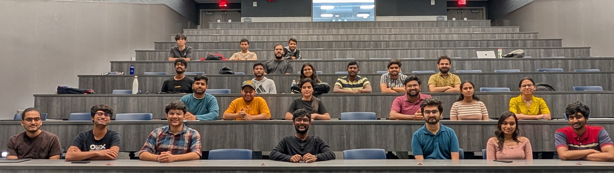

# CSE 4/573 Computer Vision and Image Processing

Welcome to CSE 4/573: CVIP course (Summer 2025). This website contains **_everything_ (all material)** for the course. To support engaging and interactive learning, this website is powered by [Jupyter Book](https://jupyterbook.org/) and the [TeachBooks](https://teachbooks.io/) package. The site hosts all course content in an accessible and interactive format, including self-hosted animated lecture slides via [Reveal.JS](https://revealjs.com/), executable live code blocks with [Thebe](https://github.com/executablebooks/thebe), rich 3D visualizations using [Plotly](https://plotly.com/python/), spaced-repetition flashcards through [JupyterCards](https://github.com/jmshea/jupytercards), and auto-graded practice quizzes via [Jupyter Quizzes](https://github.com/jmshea/jupyterquiz). This platform enhances student engagement by blending theory with hands-on experimentation directly in the browser.

## Instructor

<table style="width:100%; border-collapse: collapse; border: 1px solid; text-align:center;">
  <tr>
    <th style="width:33%; border: 1px solid gray; text-align:center; vertical-align:middle; padding:10px;">Instructor</th>
    <th style="width:33%; border: 1px solid gray; text-align:center; vertical-align:middle; padding:10px;">Website & Email</th>
    <th style="width:33%; border: 1px solid gray; text-align:center; vertical-align:middle; padding:10px;">Office Hours</th>
  </tr>
  <tr>
    <td style="border: 1px solid gray; text-align:center; vertical-align:middle; padding:10px;">
       
      Naresh Devulapally
    </td>
    <td style="border: 1px solid gray; text-align:center; vertical-align:middle; padding:10px; line-height:1.6;">
      <a href="https://naresh-ub.github.io">naresh-ub.github.io</a> 
      devulapa@buffalo.edu
    </td>
    <td style="border: 1px solid gray; text-align:center; vertical-align:middle; padding:10px; line-height:1.6;">
      Tue, Thu: 3:00 PM – 4:00 PM
    </td>
  </tr>
</table>

In-class pictures with a few students (Students Enrolled: 71)

### Feedback welcome!

If you found this course website useful, please consider the following:

- Star the Git Repo: github.com/naresh-ub/cvip
- Provide feedback at Rate my Professor: https://www.ratemyprofessors.com/professor/3113460